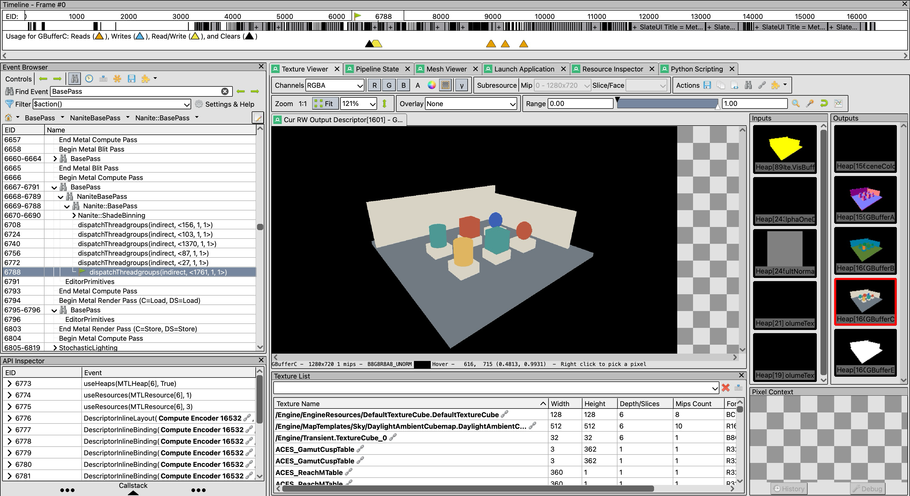

[English](README.md) · [简体中文](README-zh.md)

<p align="center">
  
</p>
<h1 align="center">RenderDoc Metal</h1>
<p align="center"><strong>Metal frame capture and graphics inspection on macOS.</strong></p>
<p align="center">
  <a href="https://github.com/crossous/renderdoc-metal/releases/tag/v1.46-metal.1"></a>
  
  
  <a href="LICENSE.md"></a>
</p>
<p align="center">
  <a href="#download">Download</a> · <a href="#try-the-ue-capture">Try the capture</a> ·
  <a href="#metal-capabilities">Capabilities</a> · <a href="#unreal-engine-integration">Unreal Engine</a> ·
  <a href="#build-and-validation">Build & validation</a>
</p>

## About this repository

This project is an independently maintained **fork of [baldurk/renderdoc](https://github.com/baldurk/renderdoc)**, based on the **RenderDoc 1.46** codebase. It was imported as a standalone GitHub repository, so GitHub does not display a fork relationship. It is not an official upstream macOS release.

The focus is the **macOS Metal capture/replay backend** and its integration with qrenderdoc. Resource recovery, address relocation, lifetime and submission handling follow the corresponding Vulkan/DX12 implementations where applicable. UE/Lumen is a validation workload; engine feature names do not decide backend support.

| Branch / release | Purpose |
| --- | --- |
| **`metal-replay-v1.46`** | Default branch; active Metal backend, tests and macOS integration. |
| `codex/ue58-safe-checkpoint` | Earlier UE integration checkpoint; retained for historical reference. |
| **`v1.46-metal.1`** | Optimized macOS arm64 Release application, distributed as a development preview. |

## In the debugger



*The provided 1280×720 UE capture, inspected at a Nanite BasePass event with GBufferC and bound resources visible. This is a real screenshot of the qrenderdoc window content; it contains no desktop or other application windows.*

<details>
<summary><strong>View the final-frame replay preview</strong></summary>


The scene enables **Lumen hardware RT / inline ray queries, Nanite and Virtual Shadow Maps**, at High quality with documented cache budgets. Actual nonzero RT and geometry commands were observed.

</details>

> **Current acceptance status:** the recorded Debug candidate completed three whole-frame GPU replays and two EID 0 resets. Comparison with the same captured Native UE viewport still fails; a separate fresh capture has an unresolved background-placement restoration failure. The downloadable Release app passed build/packaging/runtime checks, but its GPU output/full matrix has not been certified. See the [capture manifest](util/test/metal/captures/ue-lumen-nanite-vsm-720p/manifest.json) and [current evidence](docs/metal-replay/UE_UI_CAPTURE_2026-10-08.md).

## Download

**[Download RenderDocMetal.app for Apple Silicon](https://github.com/crossous/renderdoc-metal/releases/download/v1.46-metal.1/RenderDocMetal-v1.46-metal.1-macos-arm64.zip)** · [Release notes & checksums](https://github.com/crossous/renderdoc-metal/releases/tag/v1.46-metal.1)

1. Extract the ZIP and move **`RenderDocMetal.app`** to `/Applications`.
2. Open the app. The bundle includes the backend, CLI, Qt, Python and pinned shader processors; **Homebrew is not required to run it**.
3. For shader compilation/editing, install Xcode with Apple's Metal tools.

The binary is **arm64**, built with a macOS 12.0 deployment target and checked on **Apple M2 Pro / macOS 26.1**. Individual Metal APIs still require a compatible device and OS. Intel Macs and other devices are not certified by this release. The app is ad-hoc signed, not notarized; if macOS blocks it, use Apple's documented [Open Anyway workflow](https://support.apple.com/en-us/102445).

## Try the UE capture

**[Download the 1280×720 RDC](https://raw.githubusercontent.com/crossous/renderdoc-metal/metal-replay-v1.46/util/test/metal/captures/ue-lumen-nanite-vsm-720p/UE-Lumen-Nanite-VSM-1280x720.rdc)** (about 91 MB) · [Capture, previews & hashes](util/test/metal/captures/ue-lumen-nanite-vsm-720p)

Open it with **File → Open Capture**, or from Terminal:

```sh
open -n "/Applications/RenderDocMetal.app" --args "/path/to/UE-Lumen-Nanite-VSM-1280x720.rdc"
```

| Inspect | How |
| --- | --- |
| Final frame | Select the end of the frame; in **Texture Viewer**, find **`BufferedRT`**, enable RGB and disable Alpha. |
| Nanite geometry / GBuffer | Search **`Nanite`** or **`BasePass`** in Event Browser; inspect the bound inputs/outputs and Pipeline State. |
| Lumen RT dispatch | Search **`Lumen`**, select a ray-query compute event, and inspect its shader and acceleration-structure/resource bindings. A marker name alone is not proof that RT executed. |
| Virtual shadow maps | Search **`VirtualShadow`** or **`Shadow`** and inspect the associated draw/dispatch and textures. |
| Replay navigation | Move between earlier/later actions and return to the last action; inspect resource contents and bindings. Automated EID 0 tests are documented separately. |

Initial loading of this large capture took about three minutes in the recorded Debug build; Release loading time is not yet a published performance result. This is a **manual UI acceptance fixture**, not a pixel-perfect output certification. The [fixture README](util/test/metal/captures/ue-lumen-nanite-vsm-720p/README.md) explains the exact scene, comparison and SHA256 verification.

## Metal capabilities

“Implemented” describes available API paths and scoped native fixtures, not unrestricted coverage of every application or hardware configuration.

| Area | Current implementation | Scope / boundary |
| --- | --- | --- |
| Capture & replay | Metal devices, command buffers/encoders, API events/markers, frame resources, event selection and replay reset. | Finite resource budgets and genuine recovery/lifetime checks remain. |
| Raster graphics | Render passes, attachments/load-store, depth/stencil, blending, viewport/scissor, direct and supported indirect draws, MSAA/resolve. | Legal API/device constraints apply; no general Pixel History. |
| Compute | Native direct/indirect dispatch, per-use GPU arguments, barriers/fences and resource bindings. | Shader arithmetic executes natively; required addresses and dependencies must be restored. |
| Textures & buffers | Shared/Private initial state, buffer/texture copies and views, mip/array/cube/volume and supported format families. | Checked layouts, ranges and budgets; not every compressed/platform-specific format is certified. |
| Heaps & dynamic bindings | Placement/backing, typed descriptor/argument bindings, pointer relocation, resource lifetime and submission tracking. | Opaque addresses require real identity/layout information; fresh background-alias restoration still has a known gap. |
| Advanced geometry | Native tessellation and object/mesh-stage capture/replay and inspection paths with directed fixtures. | Feature and device dependent; this is not a universal UE Nanite certification. |
| Compute RT / ray queries | AS builds/initial state, refit/copy/compaction, geometry/instance inputs, function tables, compute-stage RT and converted inline-query infrastructure. | Device-dependent Native capability predicate; new-candidate whole-frame output acceptance remains separate. |
| Debugger UI | Texture/buffer/resource inspection, Pipeline State, mesh inspection, usage/binding information and shader views. | Optional shader access analysis can be partial/unknown. |
| Shader tools | Captured MSL/AIR views, guarded edit/apply/remove paths, bundled MSL/HLSL/GLSL reconstruction previews. | Apple compilation needs Xcode. Reconstruction and editing have documented ABI/subset limits. |

**Not provided:** render-stage ray tracing (`supportsRaytracingFromRender` remains false), AS-internal inspection, shader single-stepping or Pixel History. See [shader tool limits](util/shader_tools/README.md), [RT enablement scope](docs/metal-replay/RAYTRACING_ENABLEMENT.md) and [test evidence](docs/metal-replay/TEST_MATRIX.md).

## Unreal Engine integration

The project-level **RenderDoc Metal Capture** plugin adds path settings and a **Capture Metal Frame** viewport button / Tools menu entry.

1. Download the [UE plugin package](https://github.com/crossous/renderdoc-metal/releases/tag/v1.46-metal.1), or copy [`util/ue/RenderDocMetalCapture`](util/ue/RenderDocMetalCapture) into `<YourProject>/Plugins/RenderDocMetalCapture`.
2. Enable **RenderDoc Metal Capture** in the Plugins dialog. Rebuild the source plugin against your exact UE version when required; the included integration is built against **UE 5.8.3 / macOS arm64**.
3. Open **Project Settings → Plugins → RenderDoc Metal**. Set the **RenderDoc application (.app)** path, or supply the **RenderDoc library (.dylib)** path instead. The dylib field takes precedence when both are set.
4. Enable **Automatically attach on editor startup**, then restart UE. Settings are stored per user/project. Commandlets and Null RHI runs are skipped by default.
5. Use the viewport's **Capture Metal Frame** button or **Tools → Capture Metal Frame**. Captures are saved under `<YourProject>/Saved/RenderDocMetalCaptures`; open the `.rdc` in RenderDoc Metal.

| Setting | Example |
| --- | --- |
| Application | `/Applications/RenderDocMetal.app` |
| Library, optional | `/Applications/RenderDocMetal.app/Contents/lib/librenderdoc.dylib` |
| Matching MetalRHI provider, advanced | An instrumented `libUnrealEditor-MetalRHI.dylib` built from your exact UE revision. |

**Why startup re-execution?** This backend uses dyld interposition. Independent native probes found that `dlopen` exposes `RENDERDOC_GetAPI` but leaves `MTLCreateSystemDefaultDevice` unhooked, even when the Metal consumer is loaded afterward. The plugin therefore validates startup paths and **re-executes the same editor once before RHI initialization** with injection configured. It preserves arguments and existing injected libraries; it does not spawn a second editor or modify the engine installation. A one-shot guard prevents restart loops.

Ordinary direct Metal captures and UE bindless/converted RT workloads have different metadata requirements. The latter may require the exact-version [MetalRHI descriptor/address provider](util/ue/metal_provider/RenderDocMetalDescriptorProvider.h) and [provider preparation tools](util/ue/prepare_ue_metal_provider.py). The plugin does not invent missing GPU pointer layouts, and installing it alone does not certify arbitrary UE/Lumen captures. See the [plugin guide](util/ue/RenderDocMetalCapture/README.md) for build steps, automatic-attach validation and remaining integration limits.

## Build and validation

Developer requirements: Xcode/Metal tools, CMake/Ninja, Qt 5, Python development headers and the pinned shader-tool distribution. End users can use the downloadable app instead.

```sh
# Development app; build intermediates can be directed to an external disk.
bash util/buildscripts/scripts/build_metal_dev_macos.sh

# Scoped native RT validation: close UE/qrenderdoc first; GPU tests are serial.
bash util/buildscripts/scripts/test_metal_ray_basics_macos.sh
```

Follow the [Metal development guide](docs/metal-replay/README.md) and [release record](docs/metal-replay/RELEASE_2026-10-08.md) for configuration, hashes and exact test scopes. Build success, GPU completion, output comparison and overall acceptance are recorded separately; historical passing results do not automatically certify a new binary.

## Credits and license

RenderDoc and this fork's code are distributed under [MIT](LICENSE.md). Thanks to **Baldur Karlsson and upstream contributors**. Bundled Qt, Python and shader processors retain their own licenses; processor sources and license notices accompany the app. UE is not bundled and remains subject to Epic's license.

Please report Metal/macOS issues in [this repository](https://github.com/crossous/renderdoc-metal/issues), with the app version, device/OS, reproduction steps and a capture you are permitted to share. Upstream documentation remains useful for the common debugger UI: [RenderDoc docs](https://renderdoc.org/docs/).
