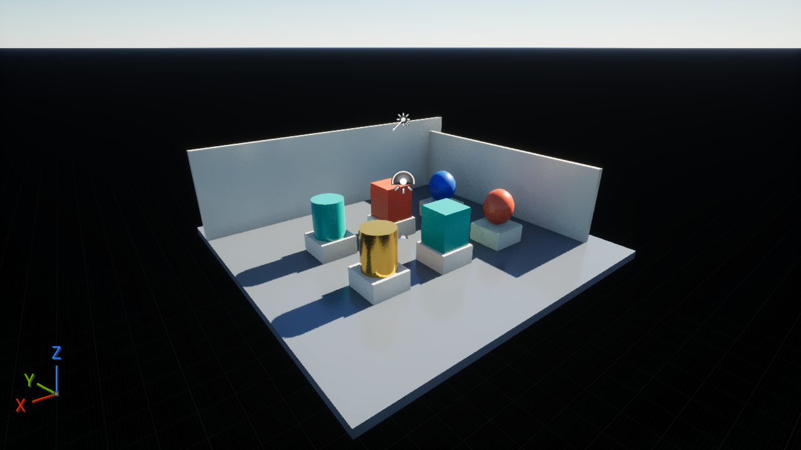

# UE Lumen / Nanite / VSM — 1280×720 UI capture

This is the UE 5.8 High-quality UI acceptance candidate recorded on 2026-10-08. Lumen hardware RT inline ray queries, Nanite, and Virtual Shadow Maps were enabled and actual nonzero RT and geometry commands were observed. The isolated scene uses 15 Nanite mesh actors and six materials. Application cache budgets are documented in `manifest.json`; this does not claim default Epic/Cinematic cache settings.

`UE-Lumen-Nanite-VSM-1280x720.rdc` is an unmodified copy of the delivered capture (90,758,617 bytes). It completed normal API loading and three whole-frame GPU replays, including two EID 0 resets, with replay backend SHA256 `1845eca83cf44f152d8b8d908df4275bcf2ba15df193c0fb10bbf61c90c67eed`. The capture and replay backend hashes differ and are separately recorded.

**GPU execution: COMPLETED. Native output comparison: FAIL. Overall acceptance: INCOMPLETE. Manual GUI acceptance: NOT_RUN.** The three replays differ from the same captured Native viewport by 18,133 / 23,804 / 15,578 pixels. No comparison tolerance has been added. The unresolved differences and a separate fresh-capture background placement failure remain documented; this file is not a new full ray-tracing enablement certificate.

From the repository root on macOS, after building qrenderdoc:

```sh
open -n "$PWD/build-macos-debug/bin/qrenderdoc.app" --args "$PWD/util/test/metal/captures/ue-lumen-nanite-vsm-720p/UE-Lumen-Nanite-VSM-1280x720.rdc"
```

Initial Debug loading took about three minutes on the recorded machine. In Texture Viewer select `BufferedRT` and disable alpha display. This capture is for explicit manual acceptance, not an automatically scheduled GPU test.



The adjacent Native PNG shows the same captured frame. Both PNGs display RGB only; exact comparison used the original UE RGB10A2-to-BGRA conversion, including all BGRA bytes. `SHA256SUMS` verifies the capture and previews:

```sh
cd util/test/metal/captures/ue-lumen-nanite-vsm-720p
shasum -a 256 -c SHA256SUMS
```

See the [mechanism changes, test results, and remaining gaps](../../../../../docs/metal-replay/UE_UI_CAPTURE_2026-10-08.md). Detailed local diagnostic artifacts remain on the external archive; no build products, UE installation, user configuration, or temporary logs are included here.
